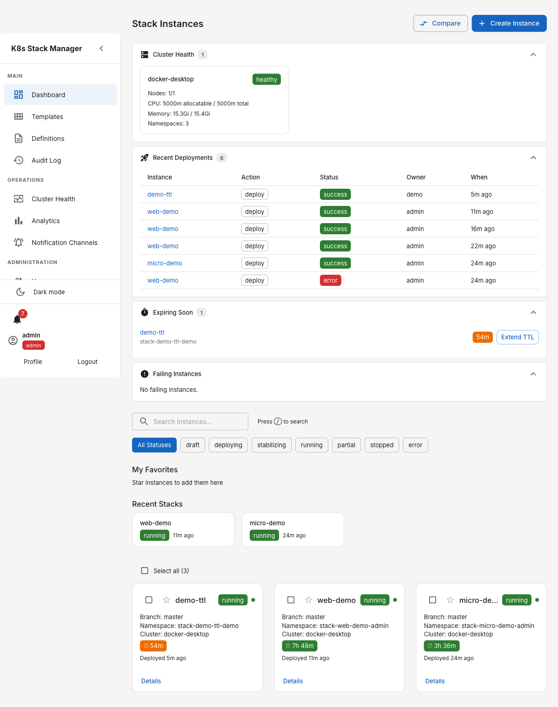
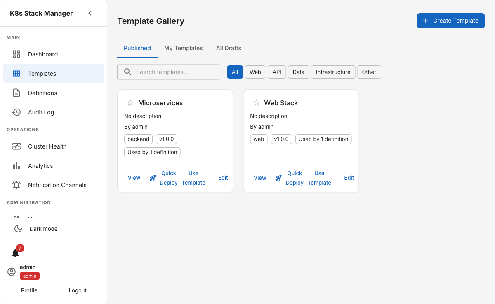
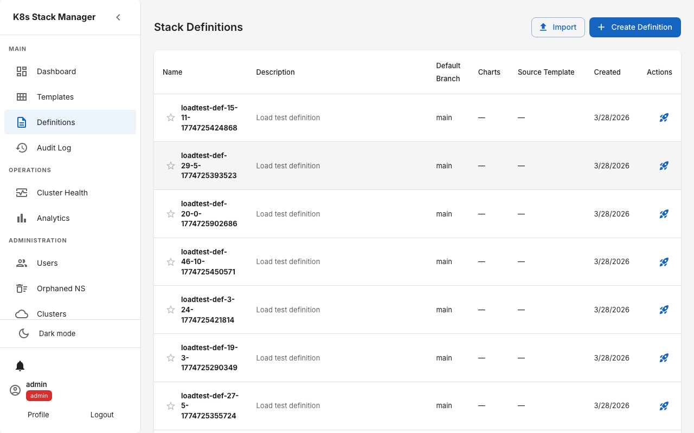
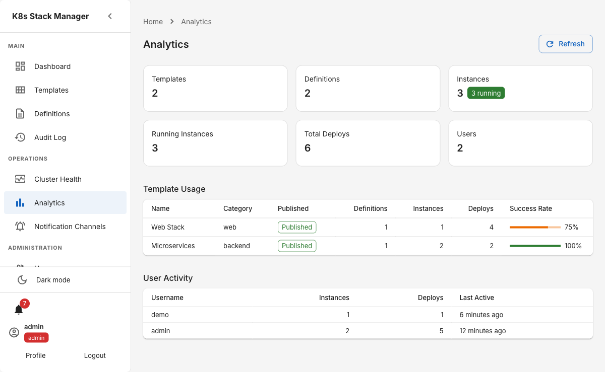
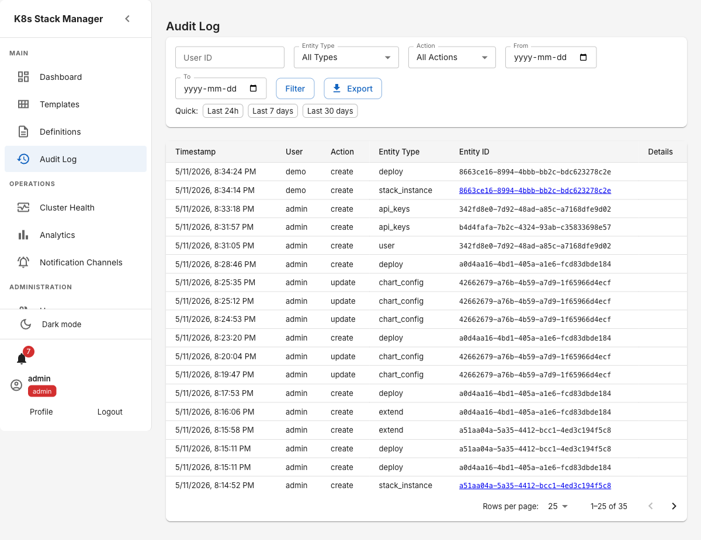
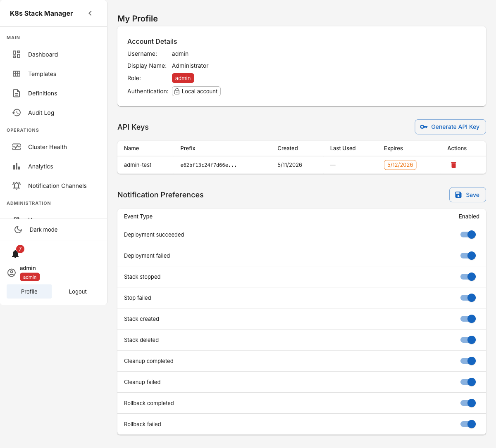

# K8s Stack Manager

A web application for configuring, storing, and managing multi-service Helm-based application stacks for deployment to one or more Kubernetes clusters.

Developers create **stack definitions** (collections of Helm charts with configuration), launch **stack instances** (per-developer copies with branch and value overrides), and manage everything through an audit-logged UI with Git provider integration.

## Getting Started

Deploy to your cluster and create your first stack in under 10 minutes:

```bash
# Install the CLI
brew install omattsson/tap/stackctl

# Add the Helm repo
helm repo add k8s-stack-manager https://omattsson.github.io/k8s-stack-manager
helm repo update

# Deploy to your cluster (see docs/getting-started.md for secrets setup)
helm install stack-manager k8s-stack-manager/k8s-stack-manager \
  --namespace stack-manager --create-namespace \
  --values stack-manager-values.yaml
```

See the full [Getting Started Guide](docs/getting-started.md) for next steps (configure stackctl, register a cluster, import [starter templates](examples/starter-templates/), and deploy your first stack).

## Features

### Dashboard — Stack Instance Management

View, search, and manage all your stack instances from a single dashboard. Filter by status (draft, deploying, running, stopped, error), star your favorites for quick access, and see recently used stacks at a glance. Bulk operations let you deploy, stop, clean, or delete up to 50 instances at once.



### Template Gallery

Browse and discover reusable stack templates organized by category (Web, API, Data, Infrastructure). Each template includes a description, version tag, and one-click **Quick Deploy** to spin up a new instance instantly. Create your own templates and publish them for your team.



### Stack Definitions

Define multi-chart application stacks with Helm chart configurations, default branches, and value templates. Import and export definitions as JSON bundles for sharing across environments. Each definition can be used to create templates or directly instantiate stack instances.



### Analytics Dashboard

Track platform usage with real-time metrics: template and definition counts, running instances, total deployments, and active users. The template usage table shows deployment success rates and adoption across the team.



### Audit Log

Full audit trail of every action in the system — creates, updates, deletes — with filters by user, entity type, action, and date range. Export logs for compliance. Every mutating API call is automatically logged with user identity and entity details.



### User Profile & API Keys

Manage your account, generate API keys for CI/CD automation, and configure notification preferences per event type (deployment succeeded/failed, stopped, deleted).



### Additional Features

- **Multi-cluster support** — Register and manage multiple Kubernetes clusters with encrypted kubeconfig storage (AES-GCM). Monitor cluster health and resource utilization.
- **Git provider integration** — Automatic branch listing from Azure DevOps and GitLab repositories, with per-chart branch overrides.
- **Helm values deep merge** — Chart defaults are deep-merged with instance overrides. Template variables (`{{.Branch}}`, `{{.Namespace}}`, `{{.InstanceName}}`, etc.) are substituted automatically.
- **Cleanup policies** — Schedule cron-based cleanup actions (stop, clean, delete) on instances matching custom conditions.
- **TTL auto-expiry** — Set time-to-live on instances; a background reaper automatically stops expired deployments.
- **Real-time updates** — WebSocket-based live updates push deployment status changes to all connected clients.
- **RBAC** — Role-based access control (admin, devops, developer) with JWT authentication and optional OpenID Connect (OIDC) SSO.
- **In-app notifications** — Get notified on deploy/stop/clean events with configurable per-user preferences.
- **Instance comparison** — Side-by-side diff of two stack instances including merged Helm values per chart.
- **Shared values** — Per-cluster shared Helm values applied to all instances, merged by priority before instance-specific overrides.
- **Dark mode** — Full dark/light theme support.

### Extending — bring your own operations

k8s-stack-manager is deliberately free of organisation-specific logic. Database refreshes, CMDB sync, policy gates, custom snapshots, Slack notifications — all of this can be added **without forking**, in any language, as a small out-of-process service.

Two mechanisms:

- **Event hooks** — POST handlers subscribe to lifecycle events (`pre-deploy`, `post-instance-create`, …). `failure_policy: fail` subscribers can abort operations to enforce policy.
- **Actions** — `POST /api/v1/stack-instances/:id/actions/:name` dispatches to a subscriber you register. Subscriber responses are forwarded verbatim to callers — so stackctl can expose them as first-class subcommands via [plugin discovery](https://github.com/omattsson/stackctl/blob/main/EXTENDING.md).

Both run over plain HTTP with HMAC signing. Build a subscriber in 10 minutes using Python stdlib (see [backend/examples/webhook-handler-python/](backend/examples/webhook-handler-python/)) or in Go ([backend/examples/webhook-handler/](backend/examples/webhook-handler/)).

👉 **[Full guide: EXTENDING.md](EXTENDING.md)** — tutorial, event reference, action contract, security, real-world recipes.

## Architecture

```
Frontend (React + MUI + TypeScript)
        │
        ▼
Backend (Go + Gin)
  ├── REST API with JWT auth
  ├── MySQL (GORM)
  ├── Git Provider (Azure DevOps + GitLab)
  ├── Helm Values (deep merge + template substitution)
  ├── Multi-cluster support (kubeconfig encrypted at rest)
  └── Audit Logging
```

## Quick Start

### Prerequisites
- Docker and Docker Compose
- Go 1.25+ (for local backend development)
- Node.js 20+ (for local frontend development)

### Start with Docker Compose

```bash
cp .env.example .env   # first time only — sets COMPOSE_PROFILES=full
make dev
```

This starts all services:
- **Frontend**: http://localhost:3000
- **Backend API**: http://localhost:8081
- **Swagger docs**: http://localhost:8081/swagger/index.html

Default admin credentials: `admin` / `admin` (configured in docker-compose.yml).

### Headless / API-only

For workflows driven by [stackctl](https://github.com/omattsson/stackctl), you can
skip the frontend container entirely:

```bash
make compose-api-only
```

`docker-compose.yml` tags the frontend service with `profiles: [full]`, so it
only runs when that profile is active. `.env.example` sets
`COMPOSE_PROFILES=full` by default — drop or override it to go headless:

```bash
COMPOSE_PROFILES=api-only docker compose up
```

> **Upgrading from a previous checkout?** If you have an existing `.env` from
> before this change, add `COMPOSE_PROFILES=full` to it (or `cp .env.example
> .env` afresh) — otherwise `docker compose up` will now start the headless
> stack. `make dev` / `make prod` force `--profile full` and are unaffected.

The matching Helm toggle is `frontend.enabled=false` (see the chart's
`values.yaml`).

### Start Locally (without Docker)

```bash
# Run backend
make dev-local

# In another terminal — run frontend
cd frontend && npm install && npm run dev
```

## Commands

| Command | Description |
|---|---|
| `make dev` | Start full stack via Docker Compose |
| `make compose-api-only` | Start backend + mysql only (headless, no frontend) |
| `make dev-local` | Run backend + frontend locally |
| `make test` | Run all tests (backend + frontend) |
| `make test-backend` | Backend unit tests |
| `make test-frontend` | Frontend unit tests |
| `make test-backend-all` | Backend unit + integration tests |
| `make test-e2e` | End-to-end Playwright tests |
| `make docs` | Regenerate Swagger documentation |
| `make lint` | Lint backend + frontend |
| `make clean` | Stop containers and remove volumes |
| `make install` | Install all dependencies |
| `make helm-lint` | Lint the Helm chart |
| `make helm-template` | Render templates locally (dry-run) |
| `make helm-install` | Install chart into current cluster |
| `make helm-upgrade` | Upgrade an existing release |
| `make helm-uninstall` | Uninstall the release |

## Project Structure

```
├── backend/                    # Go API server
│   ├── api/main.go            # Application entry point
│   ├── internal/
│   │   ├── api/               # Handlers, middleware, routes
│   │   ├── config/            # Environment-based configuration
│   │   ├── database/          # Database repositories + migrations
│   │   ├── gitprovider/       # Azure DevOps + GitLab integration
│   │   ├── helm/              # Values merge + template substitution
│   │   ├── cluster/           # Multi-cluster registry + health poller
│   │   ├── deployer/          # Helm CLI wrapper for deploy/undeploy (multi-cluster)
│   │   ├── k8s/               # Cluster client + status monitoring
│   │   ├── models/            # Domain models + interfaces
│   │   ├── scheduler/         # Cron-based cleanup policy execution
│   │   ├── ttl/               # TTL reaper for auto-expiring stack instances
│   │   └── websocket/         # Real-time event broadcasting
│   └── pkg/crypto/            # AES-GCM encryption for kubeconfig at rest (key derived via SHA-256)
│   └── docs/                  # Swagger/OpenAPI
├── frontend/                   # React SPA
│   └── src/
│       ├── api/               # API client + types
│       ├── components/        # Shared UI components
│       ├── context/           # Auth + WebSocket contexts
│       ├── pages/             # Page components
│       └── routes.tsx         # Route definitions
├── helm/k8s-stack-manager/     # Helm chart (Argo Rollouts + Traefik)
│   ├── templates/backend/     # Backend Rollout, services, config
│   ├── templates/frontend/    # Frontend Rollout, services, nginx config
│   └── templates/traefik/     # IngressRoute + middleware
├── loadtest/                   # Load testing suites
│   ├── backend/               # k6 API + WebSocket load tests
│   └── frontend/              # Playwright load tests
└── docker-compose.yml
```

## API Overview

| Group | Prefix | Description |
|-------|--------|-------------|
| Auth | `/api/v1/auth` | Login, register, current user |
| Templates | `/api/v1/templates` | Stack template CRUD, publish, instantiate |
| Definitions | `/api/v1/stack-definitions` | Stack definition CRUD, chart configs |
| Instances | `/api/v1/stack-instances` | Stack instance CRUD, clone, deploy, stop, clean, status |
| Overrides | `/api/v1/stack-instances/:id/overrides` | Per-chart value overrides |
| Branch Overrides | `/api/v1/stack-instances/:id/branches` | Per-chart branch overrides |
| Git | `/api/v1/git` | Branch listing, validation |
| Audit Logs | `/api/v1/audit-logs` | Filterable audit trail + export |
| Admin | `/api/v1/admin` | Orphaned namespace detection and cleanup |
| Clusters | `/api/v1/clusters` | Multi-cluster registration, health, test-connection |
| Shared Values | `/api/v1/clusters/:id/shared-values` | Per-cluster shared Helm values |
| Cleanup Policies | `/api/v1/admin/cleanup-policies` | Cron-based cleanup policy management |
| Analytics | `/api/v1/analytics` | Usage overview, template stats, user stats |
| Favorites | `/api/v1/favorites` | User bookmark management |
| Quick Deploy | `/api/v1/templates/:id/quick-deploy` | One-click template deployment |
| Health | `/health/*` | Liveness + readiness |

## Configuration

Key environment variables (see `docker-compose.yml` for full list):

| Variable | Required | Description |
|---|---|---|
| `JWT_SECRET` | Yes | JWT signing secret (min 16 chars) |
| `ADMIN_PASSWORD` | Yes | Initial admin password |
| `AZURE_DEVOPS_PAT` | No | Azure DevOps personal access token |
| `GITLAB_TOKEN` | No | GitLab access token |
| `DEFAULT_BRANCH` | No | Default Git branch (default: `master`) |
| `KUBECONFIG_ENCRYPTION_KEY` | No | Passphrase for deriving AES-256 key (SHA-256) to encrypt kubeconfig data at rest |
| `SESSION_STORE` | No | Session store backend: `mysql` (default) or `memory` |

## Helm Chart (Kubernetes Deployment)

The Helm chart in `helm/k8s-stack-manager/` deploys the full stack to Kubernetes using **Argo Rollouts** (canary strategy) and **Traefik** IngressRoute.

### Prerequisites
- Kubernetes cluster with `kubectl` context configured
- Helm 3+
- [Argo Rollouts](https://argoproj.github.io/argo-rollouts/) controller installed
- [Traefik](https://traefik.io/) ingress controller with CRDs

### Install

> **Note:** The Helm chart requires `backend.secrets.JWT_SECRET` at render time.
> You must provide this value via `--set` or the `JWT_SECRET` env var before running lint/install.

```bash
# Lint the chart
make helm-lint

# Install (JWT_SECRET env var required)
JWT_SECRET=my-secret-at-least-16-chars make helm-install

# Or install with custom values directly
helm install k8s-stack-manager helm/k8s-stack-manager \
  --namespace k8s-stack-manager --create-namespace \
  --set backend.secrets.JWT_SECRET=my-secret-at-least-16-chars \
  --set ingress.host=stacks.example.com

# Upgrade after changes
JWT_SECRET=my-secret-at-least-16-chars make helm-upgrade

# Uninstall
make helm-uninstall
```

### What Gets Deployed
- **Backend** — Argo Rollout (canary 20%→50%→80%) with stable + canary services
- **Frontend** — Argo Rollout with nginx serving the React SPA
- **Traefik IngressRoute** — Routes `/api/*`→backend, `/ws`→backend, `/`→frontend
- **Traefik Middleware** — StripPrefix for `/api`, secure response headers

See `helm/k8s-stack-manager/values.yaml` for all configurable values.

## Testing

```bash
make test                    # All unit tests
make test-backend-all        # Backend unit + integration
make test-e2e                # Playwright end-to-end
cd backend && make test-coverage  # Coverage report (80% threshold)
```

## License

See [LICENSE](LICENSE).
